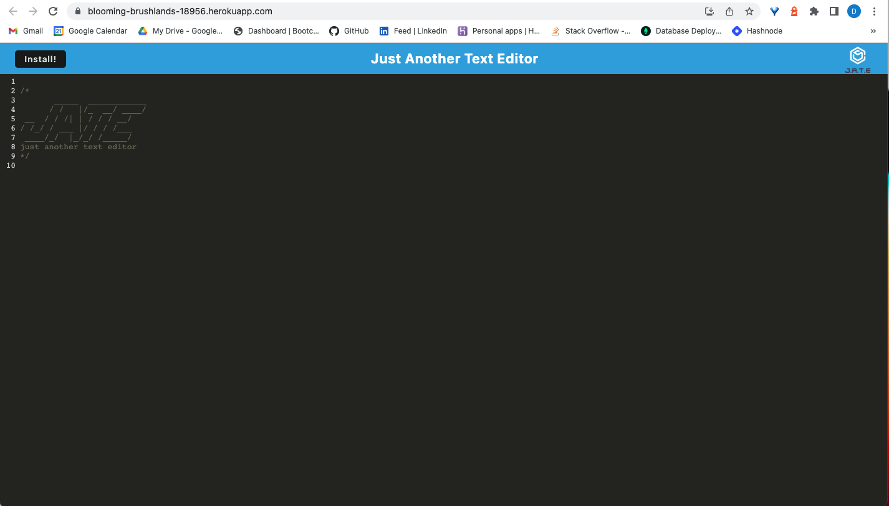
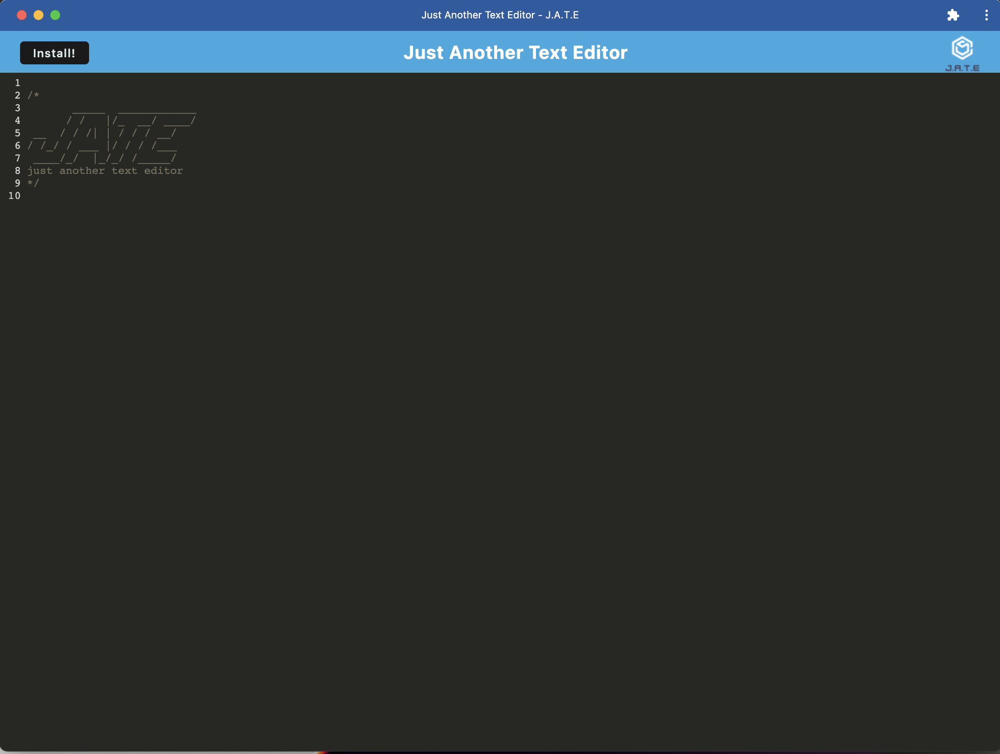

# Text Editor

## Description

This is a text editor PWA built so that it can be used either online or offline. It has been built using webpack to make it a PWA and can be installed to the desktop

## Technology used

Node, Express, Webpack, IndexedDB

## Installation

Please clone the project from the repo and then run `npm install` to download the relevant dependencies and dev dependencies. Once this has been done begin the project with `npm run start:dev`

## Usage

This project is to be used as a simple text editor. It can be used both online and offline as it can be installed on the computer. The editor will save any text entered when the DOM loses focus.

This shows the text editor in the browser:

This shows the text editor once installed:

## Deployed Site

Please follow this link for the [deployed site](https://blooming-brushlands-18956.herokuapp.com/)

## Questions

If there are any questions regarding this project please contact me through my email - dan.lawrence0810@gmail.com
Or please visit my GitHub profile which has further contact information - [DanLawrence91](https://github.com/DanLawrence91)
